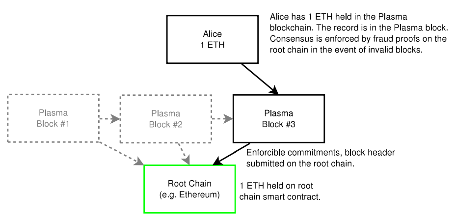
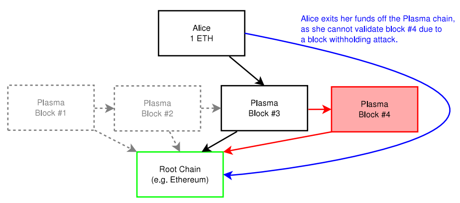
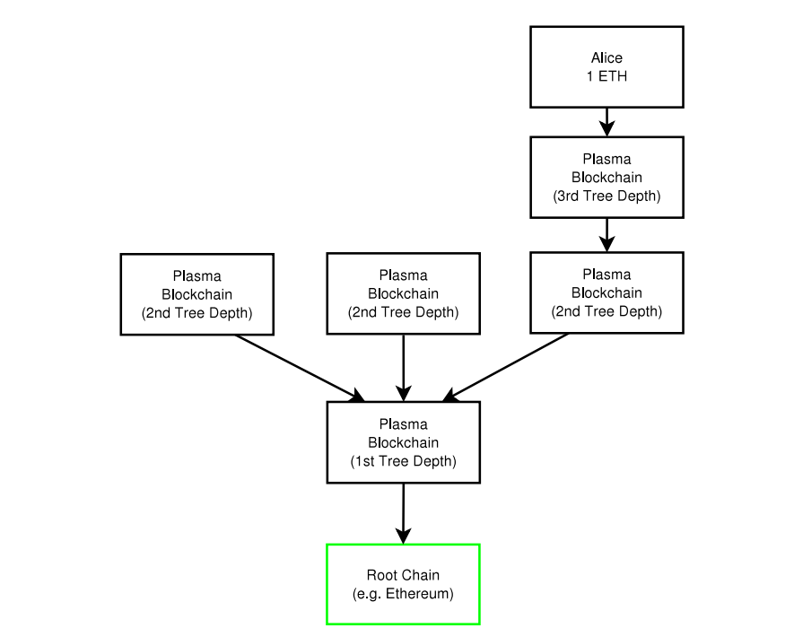
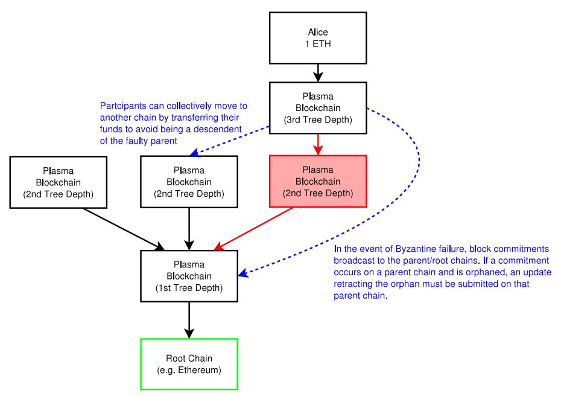
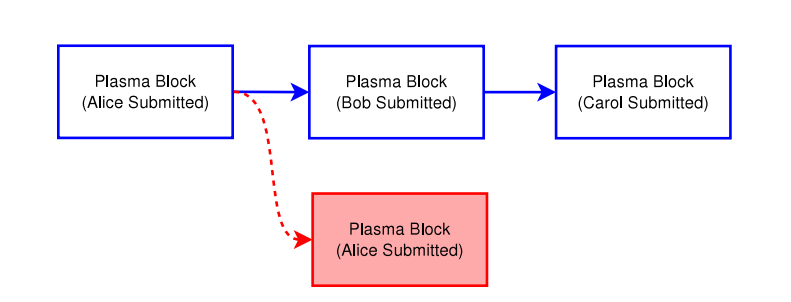
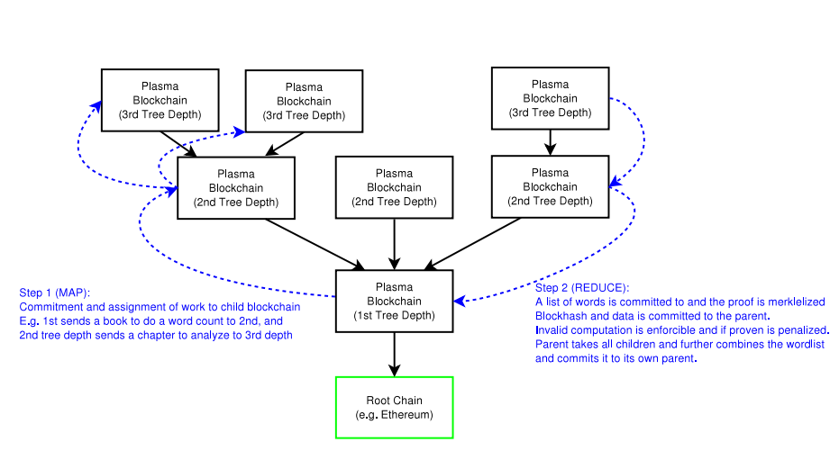
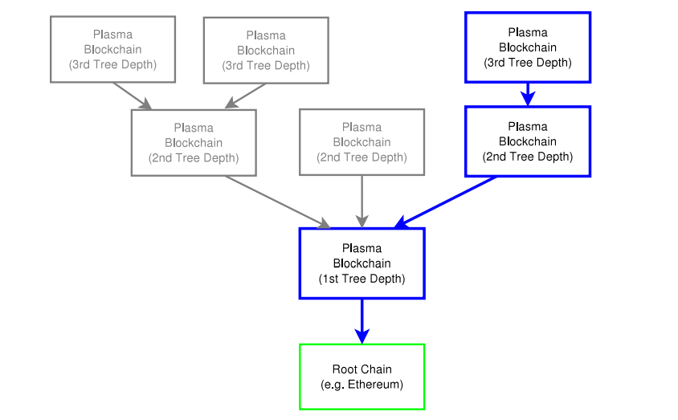

# 플라즈마

플라즈마는 컨트랙트 생성자의 상태 전환 관리없이 체인을 자동적이며 지속적으로 운영하는 경제적 인센티브를 창출하는 구조로 블록체인에서 확장 가능한 계산을 수행하는 방법이다. 이는 노드 자체가 체인을 작동하도록 장려한다.

추가적으로, 컨트랙트에서 지출된 금액을 비트맵에서 단일 비트로 최소화하여 하나의 트랜잭션과 서명이 다수의 참가자를 통합한 지불로 나타냄으로서 확장성을 갖는다. 우리는 보증된 스마트 컨트랙트에 의해 확장 가능한 계산을 할 수 있도록 MapReduce 프레임 워크를 결합시켰다.

이 구성을 통해 표면화된 당사자(externalized parties)가 마이너와 마찬가지로 자금을 보유하고 컨트랙트를 계산할 수 있게 되지만, 플라즈마는 기존 블록체인의 상단에서 실행되므로 통합된 상태 업데이트를 위해 최소 데이터를 온-체인을 사용함으로서 모든 상태 업데이트(신규 사용자의 원장 항목 추가를 포함)에 대해 트랜잭션을 생성할 필요가 없다.

그림 1: 누구나 다양한 사용 사례에 스마트 컨트랙트 확장성을 이용할 수 있도록 사용자 정의 플라즈마 체인을 만들 수 있다. 플라즈마는 루트 체인 내에서 많은 블록체인이 만들어지는것을 허용하는 일련의 스마트 컨트랙트다. 루트 체인은 플라즈마 체인의 상태를 시행한다. 루트 체인은 전 세계적으로 모든 계산을 시행하지만, 오직 사기의 증거가 있는 경우에만 계산되고 불이익을 받는다. 많은 플라즈마 체인은 자체 비즈니스 로직 및 스마트 컨트랙트의 조건과 공존할 수 있다. 이더리움에서, 플라즈마는 비-비잔틴인 경우에 엄청난 양의 계산 및 재무 원장을 오직 작은 약정으로 처리하면서 이더리움에서 직접 실행되는 EVM 스마트 컨트랙트로 구성된다. 

Plasma는 5가지 주요 구성 요소로 구성되어 있다. : 경제적으로 효율적인 방식으로 컨트랙트를 지속적으로 계산할 수 있는 인센티브 레이어, 거래 비용을 줄이고 거래의 정산을 극대화 할 수 있는 트리 구조로 하위 체인을 구성하는 구조, 이러한 중첩 체인 내에서 상태 트랜잭션의 사기 증거를 구성하여 트리 구조와 호환되도록 상태 트랜잭션을 재구성 해 높은 확장성을 갖게 하는 MapReduce 컴퓨팅 프레임 워크, Nakamoto 합의 인센티브의 결과를 재현하려는 루트 체인에 의존하는 합의 메커니즘, 대규모 출금 비용을 최소화하면서 루트 체인에서 정확한 상태 트랜잭션을 보장하기 위한 비트 맵-UTXO 약정 구조이다. 데이터 비가용성 또는 기타 비잔틴 행동의 이탈을 허용하는 것은 플라즈마 운영에서 중요한 설계 포인트 중 하나이다.

## 플라즈마 블록체인 또는 표면화된 멀티파티 채널(Externalized Multiparty Channels)

우리는 다수의 off-chain 채널이 다른 사람들을 대신하여 상태를 유지할 수 있는 방법을 제안한다. 이 프레임워크를 플라즈마 블록체인이라고 한다. 플라즈마 체인에서 보유하고 있는 기금의 경우, 사기 증명에 의해 시행되는 상태 트랜잭션과 함께 플라즈마 체인에 자금을 예치하고 인출할 수 있다. 이것은 루트 체인에 보유된 자금과 일치하는 플라즈마 블록을 고려하여 입금 및 인출할 수 있기 때문에 집행 가능한 상태와 대체 가능성을 허용한다.(플라즈마는 fractional reserve 금융 설계와 호환되지 않도록 설계되었다.)

그림 2: 플라즈마 블록체인은 블록체인 내의 체인이다. 이 시스템은 결합된 사기 증명들로 시행된다. 플라즈마 블록체인은 루트체인(예: 이더리움)에 블록체인의 내용을 공개하지 않는다. 대신, 루트 블록에 블록헤더 해시가 제출되고 루트 체인에 제출된 사기의 증거가 있는 경우 블록이 롤백 되고 블록 작성자에게 페널티를 준다. 많은 상태 업데이트가 단일 해시로 표시되므로 (일부 작은 관련 데이터 포함), 이는 매우 효율적이다. 이 업데이트는 루트 체인에 표시되지 않은 잔액을 나타낼 수 있다.(앨리스의 원장 잔액을 루트 체인에 갖고 있지 않고 플라즈마 체인에 갖고 있으며, 루트 체인의 잔액은 플라즈마 체인 자체를 시행하는 스마트 컨트랙트를 나타낸다). 회색 항목은 오래된 블록이고 검은색은 루트 체인에 전달되고 제출된 가장 최근의 블록이다.

엄청나게 많은 양의 트랜잭션이 최소한의 데이터만 루트 블록체인에 게시하면서 플라즈마 체인에 커밋될 수 있다. 또한 모든 구성원은 기존 구성원 집단이 아닌 모든 사람에게 자금을 이체할 수 있다. 이러한 이체는 루트 블록체인의 고유 코인/토큰으로(약간의 시간 지연과 증명으로) 자금을 입금 및 인출도 가능하다.

플라즈마를 사용하면 루트 블록체인에 원장에 대한 전체 기록 없이, 제 3자 또는 구성원에게 신뢰를 위임하지 않고 블록체인을 관리할 수 있다 (또는 지분 증명(proof-of-stake) 네트워크의 참가자의 네트워크). 그러나 최악의 경우, 자금이 묶이고 시간-가치(time-value)는 블록체인의 대규모 출금(exit)과 함께 사라질 수 있다.

우리는 사기 또는 비-비잔틴 행동에 대한 시도를 낮추기 위해 이 채널에서 상태를 시행하는 루트 블록체인에 스마트 컨트랙트[7]로 일련의 사기 증명을 구성했다.

이러한 사기 증명은 자금 인출에 대해 상호작용하는 프로토콜을 시행한다. 라이트닝 네트워크와 마찬가지로 자금을 인출할 때, 나가려면 종료 시간이 필요하다. 우리는 기존 구성원이 참가자의 원장 아웃풋(outputs)의 비트맵을 증명하여 상호작용하는 게임을 구성했다. 이 때, 참자가의 원장 아웃풋의 비트맵은 인출을 요청하는 UTXO 모델로 정리된 것이다. 네트워크에 있는 누구나 이미 자금이 지출되었는지 여부를 증명하는 대체 *채권* 증명을 제출할 수 있다. 이것이 올바르지 않은 경우 네트워크의 모든 사람이 사기 행위를 입증하고 채권을 철저히 조사하여 증명을 되돌릴 수 있다. 충분한 시간이 지나면 두 번째 *채권* 라운드에서 철회가 발생할 수 있다. 이 상태는 저장된 타임스탬프 *이전* 상태에 있는 채권이다. 이렇게 하면 일괄 철회 처리가 가능해지므로 잘못된 플라즈마 체인을 신속하게 종료할 수 있다. 이러한 대량 철회 이벤트에서, 참가자는 상위 블록체인에서 2비트 미만의 블록 공간만으로도 종료할 수 있다.

block withholding 공격의 경우, 참가자는 이전의 다른 오프 체인 제안과 비교하여 상당한 비용 절감으로 대규모 출금(exit)을 신속하고 저렴하게 수행할 수 있다. 또한 이는 유효성 검사 노드 연합(Sidechain Functionaries, Fishermen)에 대한 어떠한 신뢰도 필요없다.

그림 3:  block withholding시 자금 출금. 빨간색 블록(블록 #4)은 루트 체인에 withheld 및 커밋된 블록이지만, Alice는 플라즈마 블록 #4를 검색 할 수 없다. 그녀는 루트 체인에 자금의 증거를 브로드캐스팅함으로써 종료할 수 있으며 인출은 분쟁을 허용하기 위해 약간의 지연 후에 처리된다.

Lightning을 어떻게 닫을것인가가 두 참가자 간의 무한한 지불 시행을 가능하게 하는 상호 작용 메커니즘인 것처럼, 이것은 n참가자 간의 상호 작용 메커니즘을 허용한다. 가장 큰 차이점은 모든 참가자가 상태를 업데이트하기 위해 온라인 상태일 필요는 없으며, 참여자는 자신의 참여를 가능하게하기 위해 루트 블록체인에 대한 기록을 필요로 하지 않는다는 것이다. - 플라즈마 체인을 트리 형식으로 구성할 때 트랜잭션을 확인하기 위한 최소한의 테이터로 온-체인에 직접적인 상호 작용 없이 가장 작은 비용으로 플라즈마에 자금을 배치할 수 있다.

## 블록체인의 집행 가능한 블록체인

그림 4: 플라즈마는 트리 형식으로 블록체인을 구성한다. 블록 커밋 흐름이 아래로 내려가고 출금(exit)은 모든 부모 체인에 제출될 수 있으며 궁극적으로 루트 블록체인에 커밋된다.

우린 법원 시스템과 유사한 메커니즘을 구축했다. 라이트닝 네트워크가 궁극적으로 루트 블록체인에서 시행 할 수 있는 지불을 위해 판결 레이어를 사용한다면, 우리는 비-비잔틴 상태에서 가용성을 극대화하고 비용을 최소화하기 위해 상급 법원과 하급 법원을 만들었다. 체인이 비잔틴인 경우, 상위 블록(루트 블록체인 포함) 중 하나를 선택하여 작업을 계속하거나 현재 커밋된 상태로 종료할 수 있다. 증가하는 논스 상태의 시행(폐지를 통한) 대신, 우리는 잔액 및 체인 계층 구조의 상태 변화를 시행하기 위한 사기 증명 시스템을 구축했다.

실제로, 우리는 상위 체인에만 주기적으로 커밋되는 상태 변화를 만들 수 있다(그 후 루트 블록체인으로 이동). 비잔틴의 조건에서 상위(또는 루트) 체인에만 가공되지 않은 데이터(raw data)를 전송할 수 있기 때문에, 이것은 굉장한 양의 계산 및 계정 상태(account state)를 허용한다. 상위 플라즈마 체인을 사용하여 상태를 시행할 수 있기 때문에 부분적으로 비잔틴 상태를 복구하는 것은 비용이 최소화된다.

이 자녀 블록체인은 루트 블록체인(예: Ethereum)의 최상위에서 실행되며 루트 블록체인의 관점에서 볼 때, 지분 증명(proof-of-stake) 규칙 및 블록체인의 비즈니스 로직을 적용하기 위해 컨트랙트에 서명된 토큰만으로 주기적인 약속을 볼 수 있다.

이것은 블록 가용성을 극대화하고 누군가의 코인 유효성 확인을 위해 수고를 최소화하는데 커다란 이점이 있다. 그러나 모든 데이터가 모든 당사자(특정 상태를 증명하고자 하는 사람)에게 전파되는 것은 아니기 때문에, 당사자는 주기적으로 특정 체인을 모니터링하여 사기를 처벌할 책임이 있을 뿐 아니라, block withholding 공격이 발생하면 개인적으로 신속히 체인을 나가야 한다.

그림 5: 결함이 있는 블록체인(빨간색으로 표시됨)은 상위 플라즈마/ 루트체인 (오른쪽 파란색 점선)에 약속을 브로드캐스팅하여 주위에 라우팅된다. 3번째의 플라즈마체인에 참여한 사람들은 일정 시간이 지나면 다른 체인으로 다 같이 집단 이동(왼쪽 파란 점선)을 한다.

비-비잔틴 환경에서 이 구조는 블록체인 상태의 트리를 통합하고 모든 하위 플라즈마 체인을 업데이트한다. 모든 체인을 통한 전체 업데이트는 서명이 있는 32바이트 해시로 증명할 수 있다.

## 플라즈마 지분 증명 (proof-of-stake)

단일 검증자를 사용하여 다른 사람을 대신하여 펀드를 보유 할 수 있는 것은 상당히 흥미롭지만, 우린 한 당사자가 ETH 본딩 또는 토큰으로 본딩해야 하는 지분 증명(proof-of-stake) 프레임 워크를 사용하여 여러 검증자들로 상태를 시행할 수 있는 방법을 제안한다.(예: ERC-20)

이 지분 증명 시스템의 증거에 대한 합의 메커니즘은 다시 온-체인 스마트 컨트랙트에 적용된다.

우리는 나카모토 컨센서스(Nakamoto Consensus)와 비슷한 인센티브를 재현하려고 노력했지만, 지분 증명(proof-of-stake) 방식을 사용한다. 우린 나카모토 메커니즘의 결과로 만들어진 보다 유용한 인센티브 메커니즘 중 하나로서 block withholding 공격을 최소화하는 놀라운 인센티브 메커니즘이 있다고 믿고있다. 여기서는 리더는 확률적으로 선출되며 시간이 지남에 따라 확률적으로 알려진다(원래 구현에서는 6-confirmations임). 블록을 발견하면 리더가 될 가능성이 높지만, 리더가 될지는 아직 확실하지 않다. 리더가 되도록 하기 위해서는 네트워크의 모든 참가자에게 자신의 블록을 퍼트려 자신의 배당률을 극대화해야 한다. 우리는 비록 이것이 나카모토 메커니즘의 주요한 키는 아닐지라도 이 인센티브를 재현하려 시도하는데 의미가 있다고 믿는다.

한명이 계속해서 리더로 선출된다면 다수의 카르텔에의한 block withholding 공격이(또한 "데이터 가용성"문제로 일반화 될 수 있음) 확대될 수 있기 때문에 지분 증명은 이슈가 있다.

이해 관계자가 새로운 블록의 커밋된 해시를 포함하는 루트 블록체인 또는 상위 플라즈마 체인에 블록을 게시할 수 있게 함으로서 우린 플라즈마 지분 증명에서 이러한 문제를 완화시킬 수 있다. 검증자는 유효성을 완전히 검사한 블록만 연결한다. 그들은(최대의 정보 공유를 장려하기 위해) 블록을 병렬로 구축 할 수 있다. 우리는 정확하게 나타내기 위해 더 많은 수수료를 보상함으로 현재의 보유자(staker)의 비율(예: 누군가 코인의 3%를 소유한다면, 그것들은 지난 100개의 블록 중 3 %가 되어야 함)과 일치하는 지난 100개의 블록을 나타내기 위해 검증자를 위한 인센티브를 창출한다. (보유자들의 최적화되지 못한 행동으로 인해) 초과되는 수수료는 후에 수수료를 지불하기 위해 풀로 간다. 지난 100개의 블록의 데이터를 포함하는 모든 블록에는 (논스와 함께) 약속이 존재한다. 올바른 체인 마지막은 가장 높은 수수료가 합산 된 체인이다. 일정 기간이 지난 후에, 블록은 마무리(finalized)된다.

그림 6: 그림 6: Alice, Bob 및 Carol은 같은 양을 가진 3명의 검증자라고 가정한다. 그들은 최대 이익을 위한 라운드 로빈 구조를 구축하기 위해 공동으로 인센티브를 제공받는다. 이러한 약속은 상위/루트 체인에 제출된다. 체인의 끝은 n 개의 기간 동안 블록을 올바르게 분배하여 최대 가중치 점수에 부합하는 것 결정된다.(파란색은 현재 후보 체인의 끝, 빨간색은 고아(orphan)이다). 최적화되지 못한 체인 끝은 어떤 임계치(예: 90%) 이상의 정확성을 지닌 미래 검증자를 위해 초과한 비용을 다시 풀에 넣는다. n기간 후에 파란 체인의 끝이 완결(finalized) 되어질 것이다.

이것은 참여자들이 나카모토 컨센서스(Nakamoto Consensus)에서 51% 공격 가정에 참여하고 이를 복제하도록 권장한다. block withholding 또는 기타 비잔틴 행동을 통해 체인이 공격받는 경우, 비-비잔틴 참가자는 상위/루트 체인에서 대량의 계약 철회를 간결하게 수행할 수 있다. 가장 상위의 플라즈마 체인에 대한 채권이 토큰 형태로 존재할 경우, 토큰의 가치는 대량 출금(exit)의 결과로 엄청나게 가치가 낮아질 수 있다.

## 맵리듀스(MapReduce)로서의 블록체인

blockchain : git :: Plasma : Hadoop (MapReduce)

MapReduce 형식으로 계산을 구성함으로, 계산 및 상태 트랜잭션을 계층적 트리에서 쉽게 디자인 할 수 있다.

MapReduce는 수천 개의 노드에서 대규모 계산을 위한 프레임 워크를 제공한다. 블록체인은 계산 규모를 충족시키는 데 있어 비슷한 문제를 안고 있지만, 계산 증명을 생성하는 데 추가적인 요구 사항이 있다.

그림 7 : 파란색은 상위 블록에서 하위 블록에게 전달되는 메시지이다. 하위블록들은 n 블록 이내의 상위 블록에 커밋해야 하며 그렇지 않으면 체인이 중단된다. 블록 데이터는 계산을 위탁한 하위 블록에게 작업을 분배한다. 3레벨 자식체인은 계산을 수행하고 단어의 목록을 반환한다.(예: 계산하는 과정에서 , 단어 "Hello"가 3 번 발생하고 단어 "World"가 두 번 나타남) 단어 목록 데이터는 약속의 일부로 부모에게 반환되고, 단어 목록은 하위로부터 결합되어 상위로 제출되며, 궁극적으로 전체 단어 목록을 완성한다. (예: 전체 자료에는 단어 "Hello" 100번과 “World” 150번이 포함됨). 이렇게 하면 매우 많은 양의 데이터와 작업을 처리하기 위해 루트 체인에서 커밋된 하나의 블록 헤더/해시만으로도, 경제적이며 실행 가능한 계산을 생성할 수 있다. 이의제기가 된 결함이 있는 블록의 경우를 제외하고, 그 외에는 매우 적은 양의 데이터가 루트 체인에서 주기적으로 제출된다.

우리는 map 단계가 계산한 데이터에 대한 확약을 입력으로 포함하는 방법과, reduce 단계에서 결과를 리턴할 때 Merkleized 상태 변화 증거를 포함하는 방법을 제안한다. Merkleized된 상태의 변화는 루트 블록체인에 구성된 위조 증명을 통해 시행된다. 또한 zk-SNARKs 상태 변화 증명을 구성하는 것도 가능하다. 일부 계산 구조에서는 reduce 단계에서 상태 변화에 대한 비트맵이 필요할 수도 있다(따라서 이러한 사용 사례를 위해 각 UTXO/계정은 한 비트 이상 이용 할 수 있다).

우리의 구성은 시간 또는 속도의 균형을 맞추어 엄청난 대규모의 계산을 가능하게 한다. 이러한 균형은 노드가 계산을 하고 참여자가 이를 확인하는 네트워크를 만든다. 이것은 신뢰 없이 계산을 외부에서 완전히 아웃소싱 할 수 있는 시스템을 생성하는 것이 아니라, 보증된 증명으로 계산을 압축하는 기능을 가능하게 한다. 이러한 보증된 증명은 참가자들이 정직하게 해당 사항을 증명하게 한다. 이것은 다시 라이트닝 네트워크 이야기로 돌아가는데, 이건 마치 숲에서 나무가 떨어졌을 때 그 소리를 듣는 사람이 없어서 정작 소리가 났는지 안 났는지는 중요하지 않다고 추정할 수 있습니다. 마찬가지로 아무도 계산을 감시하고 있거나/수행하지 않으면 올바른 것으로 추정되는지 혹은 결과가 무엇인지는 중요하지 않다고 추정할 수 있다. 계산은 네트워크의 모든 참가자가 볼 수 있지만 잔액을 소유하고 있거나 정확한 계산이 필요한 참가자는 정기적으로 체인의 정확성을 확인할 것이다. 스케일링의 이점은 경제적으로 영향을 받지 않는 체인을 지켜봐야 한다는 요구사항을 제거함으로서 올바르게 작동하길 바라는 체인만 주시하면 된다는 것이다. 다른 플라즈마 체인에서의 작동은 최소 상태로 표현할 수 있는데 영향을 주는 계산을 위해 reduce 단계의 일부로 함께 엮여 있다. 예를 들어, 분산된 거래의 경우 어떤 거래 상대방이 어떤 주문을 하는지 상관하지 않고 하나의 통합 주문서만 볼 필요가 있으므로 다른 모든 체인을 단일 거래 상대방으로 관찰하면 된다. 반면에 누군가의 개인 체인은 트랜잭션의 시행과 (자신을 포함하여)정확한 사람에게 주문한 것이 완전히 검증되어 있을것이다. 또 다른 예로는 플라즈마 체인 트리에서 BBS를 구성 할 수 있으며, 관심이 없는 주제에 대한 업데이트를 받을 필요가 없다.

그림 8: 자신이 시행하고자 하는 데이터만 보아야 한다. 경제적 활동이나 계산이 시행할 필요가 없는 다른 플라즈마 체인에서 발생하면 (회색) 다른 모든 체인을 단일 거래 상대방으로 여길 수 있다. 예: 플라즈마의 탈중앙화된 거래에서는 오직 자신의 약속에 영향을 미치는 체인을 지켜봐도 된다(굵은 파란색).

## 영구적으로 탈중앙화되어 있고 자율적인 블록체인의 경제적 인센티브에 대한 설명

우리는 하위 블록체인을 지속적으로 운영하여 경제적인 인센티브를 창출 할 수 있는 구조를 제안한다. 중대한 복잡성이나 상태 변화에 의존성을 필요로 하지 않는 상태의 경우, 네이티브 토큰(예: 이더리움의 경우 ETH)은 상태를 증명하는데 사용 될 수 있다. 그러나 복잡한 컨트랙트의 경우에도, 활성 된 상태를 보장하는 것과 시스템의 공정성을 보장하는데 대한 인센티브 때문에 체인 운영을 지속할 수 있는 상당한 동기가 있다.

모든 플라즈마 체인은 일련의 계약으로 표현된다. 이러한 컨트랙트는 체인의 합의 규칙을 시행하고, 위조 증명이 제기되어 적용되면 사기에 대한 상당한 페널티를 부과한다.

그러나 비잔틴 상태를 피하는 것을 장려하기 위해, 특히 정확성과 liveness에 대한 인센티브를 부여하기 위해서는 컨트랙트당 토큰을 만드는 것이 이상적일 수 있다. 이 토큰은 컨트랙트 운영에서 네트워크 효과를 나타내며, 이 컨트랙트의 보안을 최대화하기 위한 인센티브를 제공한다. 플라즈마 체인은 지분증명(Proof-of-Stake) 구조로 네트워크를 보호하기 위해 토큰을 요구하기 때문에, 보유자는 토큰의 가치를 잃을 수 있는 비잔틴의 행동이나 결함을 막도록 장려된다. 토큰의 역할은 잘못된 행동을 했을경우 토큰 가치 감소를 통해 검증자가 비용을 지불하게 하는 것이다.

사용자를 대신해 자금을 보유하는 기본 컨트랙트와 같은 간단한 컨트랙트와 비즈니스 로직을 사용하여 이더리움 채권은 플라즈마 체인의 지분을 나타낼 수 있다.

채권(혹은 토큰이나 ETH)을 발행하는 지분은 네트워크 운영에 대한 거래 수수료를 받기 때문에 네트워크 운영을 지속하도록 장려한다. 이러한 거래 수수료는 비-비잔틴의 행동을 장려하는 네트워크의 유지자(stakers)들에게 지급되며, 토큰에 대한 장기적인 가치를 창출한다.

유지자들(stakers)은 거래 수수료를 받기 위해 이 네트워크를 계속 운영하도록 장려되기 때문에 루트 블록체인의 계약에 정의된 위조 증명을 지키면서 지속적으로 체인을 운영할 것이다.
